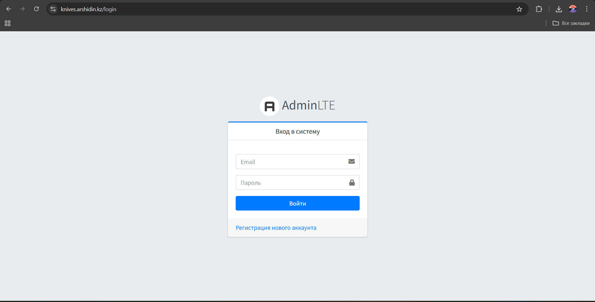
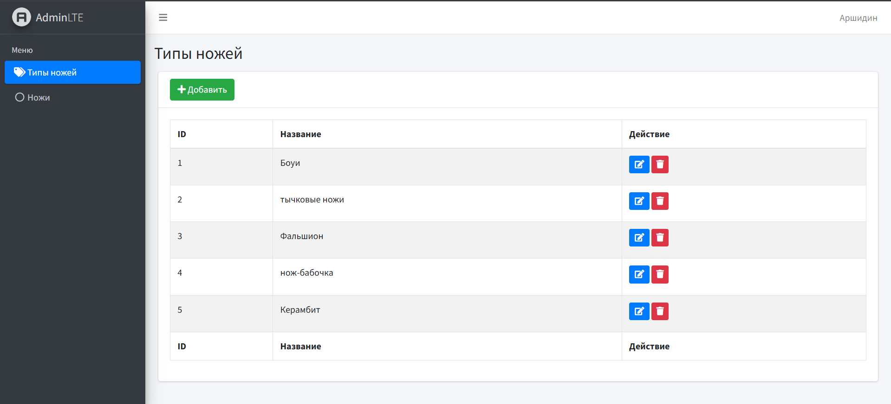
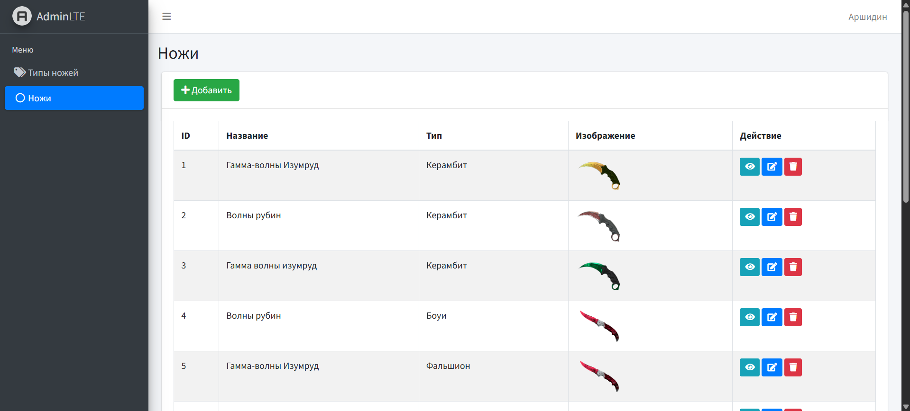
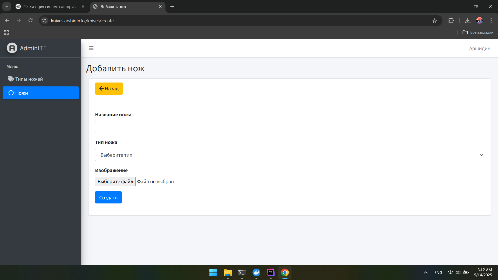
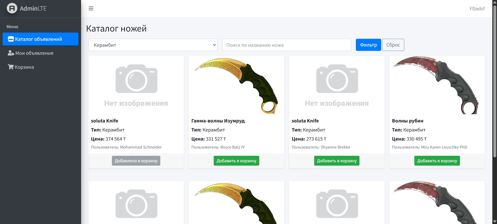
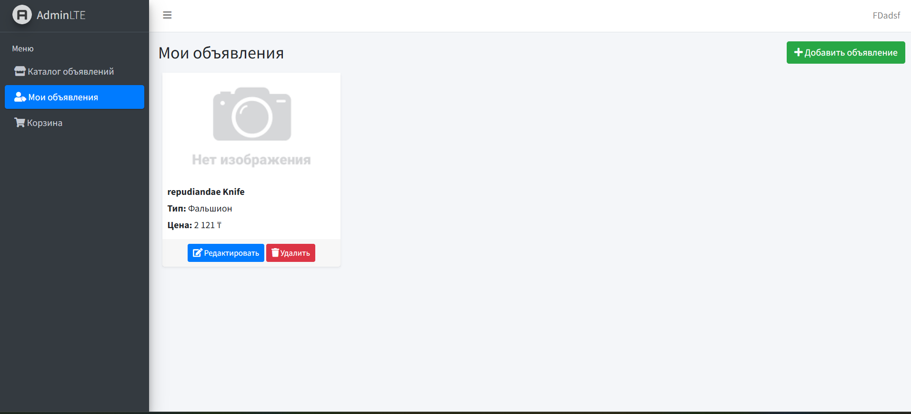
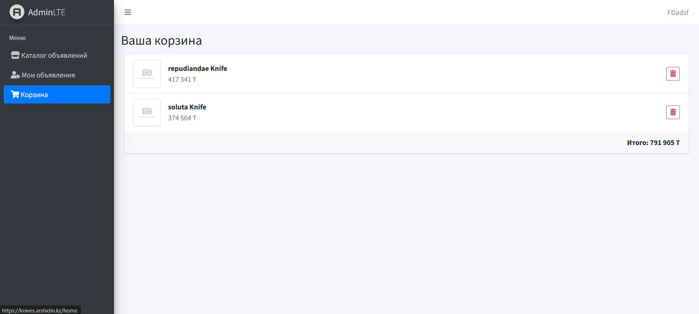
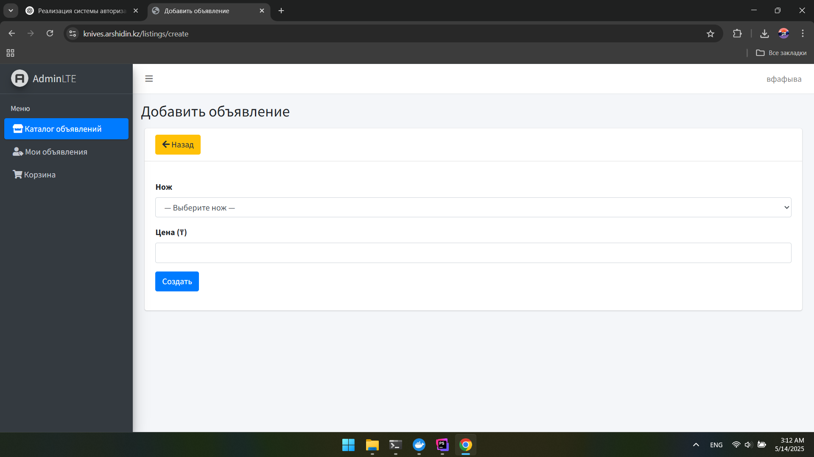

## Тестовое
### https://knives.arshidin.kz/login

## Скриншоты

### Вход

### Регистрация

### Админ – список типов ножей

### Админ – список ножей

### Админ – добавить нож

### Пользователь – список объявлений

### Пользователь – мои объявления

### Пользователь – корзина

### Пользователь – добавить объявление

Данные для входа в роли Админа(если нужно):
email: arshi@gmail.com
password: qazwsx

Потратил примерно 6–7 часов (начал около 20:00).
Реализовал систему авторизации для двух типов пользователей, которые определяются по полю is_admin в таблице users.

Админ может добавлять типы ножей, а также сами ножи.
Обычные пользователи могут просматривать каталог ножей, фильтровать их по типу, искать, а также добавлять и редактировать свои объявления.

При добавлении объявления пользователь должен выбрать название ножа, который предварительно был добавлен админом через админ-панель. Также реализована корзина — в неё можно добавлять ножи и удалять их оттуда.

Сложности возникли при попытке реализовать поиск ножей во время создания объявления  хотелось, чтобы пользователь не листал вручную весь список. Рассматривал использование Select2, но так как раньше с ним мало работал, возникли трудности. Из-за ограниченного времени решил  оставить ручной выбор.

Что можно было бы улучшить:

Провести небольшой рефакторинг: вынести логику в Actions, Services, Repositories.

Сейчас есть редирект функция, которая прописано прямо в routes/web.php  это стоит поправить и перенести в контроллер.

Было бы удобно добавить поле knife_type_id в таблицу listings, чтобы улучшить UX. Тогда при создании объявления пользователь сначала выбирал бы тип ножа, и только потом из отфильтрованного списка — нужный нож. Это упростило бы выбор.
